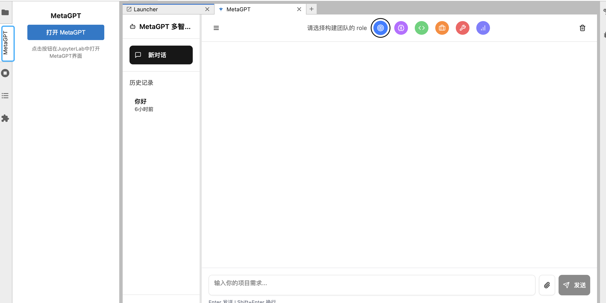
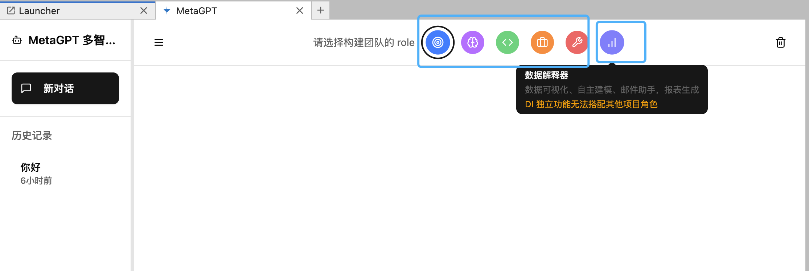
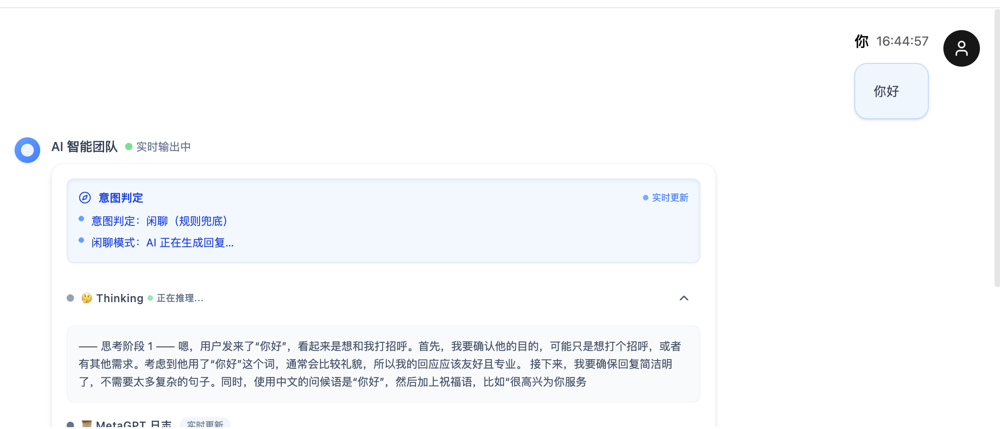
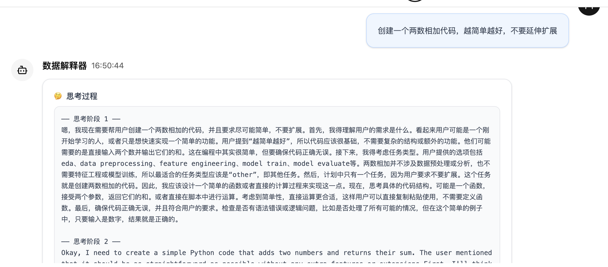
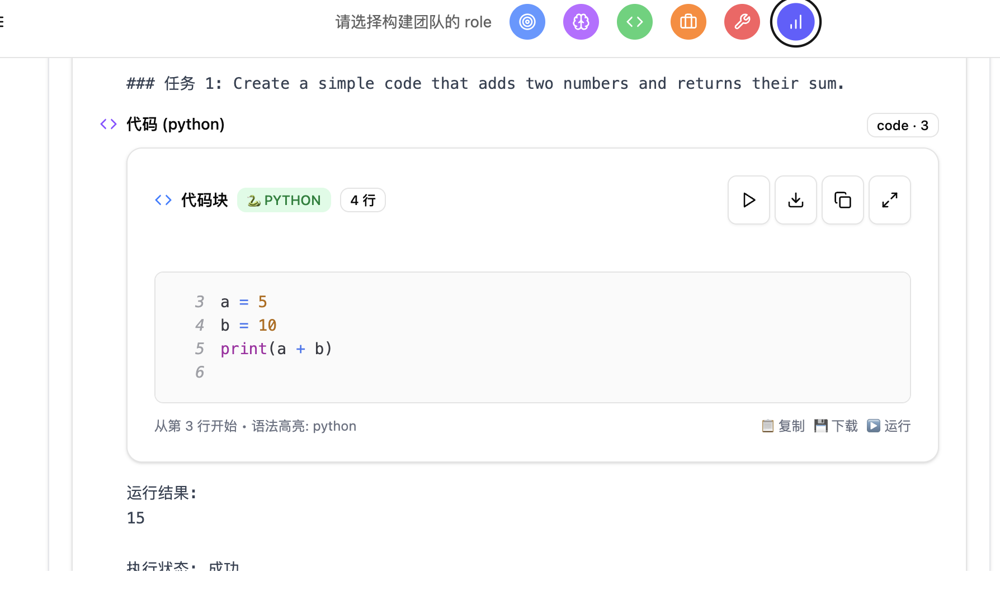
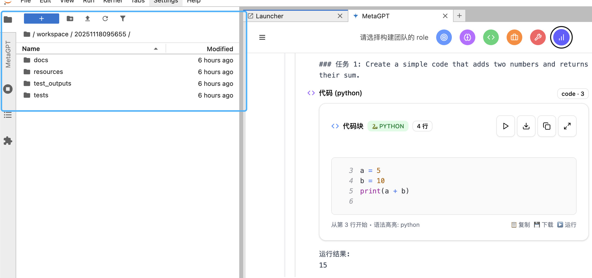

# MsyMetaGPT
1.  本项目主要对 metagpt 功能进行了封装并构建了可视化的前端页面；内嵌注册到 Jupyterlab 扩展中，方便安装且在 Jupyterlab 中使用，当前 demo 版本实现目标：一句话生成一个可运行的项目 demo

2. 当前项目核心功能主要依据 metagpt ，地址：https://github.com/FoundationAgents/MetaGPT， 页面设计形式部分参考的 MGX ：https://mgx.dev/

3. 进入后页面效果如下所示:  

   

4. 功能包含项目团队 role 选择以及 DI 数据分析器role 选择

   

5. 新增功能意图识别：闲聊 or  Agent 任务

   

   

   

   

   

6. 生成结果展示：

   

7. 已优化功能： 

   1. 优化用户页面交互体验以及显示页面效果；
   2. 去掉复杂的设置标签按钮；降低使用门槛
   3. 优化历史记录显示;(当前还存在部分问题) 
   4. 优化前端页面输出逻辑(后端日志收集后在前端流式生成显示，原metagpt 只有后端日志输出)；
   5. 优化流式输出内容结构以及显示效果
   6. 适配本地 ollama 模型
   7. 处理项目 role 和 DI 解释器隔离使用问题
   8. 处理 stop 功能停止当前任务后，metagpt 任务也停止，无法连续使用 metagpt 的问题

8. 待优化功能(随缘更新)：

   1. 当前 Agent 任务生成过程中，日志显示依然存在一些问题不够美观
   2. 生成的日志以及数据类型比较多，当前进处理了部分数据格式
   3. 输出结果框的查看文件，下载 workspace，运行代码，复制代码等功能还未实现，仅仅是显示出来了
   4. 页面展示效果还需要继续优化
   5. 不同的 role 对不同类型的文件处理方式已经确定，但是还未实现

